# Insider Threat Detection on the CERT Dataset
### A comparative study of classical machine learning and deep learning methods for detecting insider threats in the CERT r4.2 dataset. This project implements and compares multiple anomaly detection approaches including classical ML (Random Forest, XGBoost), LSTM-based autoencoders, Transformer-based models, and InceptionTime.


---

## Overview

This project benchmarks **six anomaly detection approaches** on the [CERT Insider Threat Dataset](https://kilthub.cmu.edu/articles/dataset/Insider_Threat_Test_Dataset/12841247), ranging from classical machine learning baselines to state-of-the-art deep learning models. The goal is to determine which approach best identifies malicious insider activity in user behavioral time based data — a highly imbalanced, real-world security problem.

The dataset presents a challenging class imbalance: only ~9% of samples are labeled as malicious, making naive accuracy misleading. All models are therefore evaluated using **F1-score**, **AUC-ROC**, and **Precision-Recall** as primary metrics.

---


### Key Features

- **Multi-source Feature Engineering**: Extracts behavioral features from 5 event types (logon, device, file, http, email)
- **Temporal Sequence Modeling**: Constructs time-series sequences for deep learning models
- **Multiple Baseline Comparisons**: Implements both classical ML and deep learning approaches
- **Configurable Anomaly Ratios**: Tests models at different positive class ratios (e.g., 0.5%, 1%, 5%)
- **Comprehensive Evaluation**: Reports ROC-AUC, Precision-Recall curves, TPR/TNR analysis, and optimal threshold selection


## Dataset

### CERT Insider Threat Dataset (r4.2)

 — Carnegie Mellon University SEI. Simulates 18 months of enterprise user activity (~1,000 users) across logon, file, email, HTTP, and USB events. Ground-truth labels mark malicious insider sessions.

Obtain via: https://kilthub.cmu.edu/articles/dataset/Insider_Threat_Test_Dataset/12841247

Place in `data/raw/` (gitignored). See [`data/README.md`](data/README.md).


The dataset comprises 5 event types logged over ~18 months:

| Event Type | File       | Key Fields                                      | Description                                  |
|-----------|------------|-------------------------------------------|----------------------------------------------|
| **Logon**     | logon.csv  | user, pc, date, activity (Logon/Logoff)    | Computer logon/logoff events                |
| **Device**    | device.csv | user, pc, date, activity (connect/disconnect) | USB device connections                      |
| **File**      | file.csv   | user, pc, date, filename, content          | File copy/access operations                 |
| **HTTP**      | http.csv   | user, date, url, content                    | HTTP browsing activity                      |
| **Email**     | email.csv  | user, date, from, to, cc, bcc, attachments | Email communications                        |

### Feature Engineering

Features are engineered at the **user-day level** by aggregating behavioral signals:

#### Logon Features
- `num_logons`: Total logons per day
- `num_logoffs`: Total logoffs per day
- `logon_on_own_pc_normal`: Logons to assigned PC during work hours
- `logon_on_other_pc_normal`: Logons to other PCs during work hours
- `logon_on_own_pc_off_hour`: Logons to assigned PC outside work hours (8AM-7PM)
- `logon_on_other_pc_off_hour`: Logons to other PCs outside work hours
- `num_logons_off_hour`: Total off-hour logons
- `avg_logon_hour`: Average hour of logon activity
- `num_distinct_pcs`: Number of distinct PCs accessed

#### Device Features
- `device_connects_on_own_pc_normal_hour`: USB connects during work hours
- `device_connects_on_other_pc_normal_hour`: USB connects on other PCs
- `device_connects_on_own_pc_off_hour`: USB connects outside work hours
- `device_connects_on_other_pc_off_hour`: Off-hour USB connects on other PCs

#### File Features
- Document copy operations (own/other PC, normal/off-hour)
- Program file operations (own/other PC, normal/off-hour)
- Classified by file extension (`.doc`, `.docx`, `.pdf`, `.xls`, `.exe`, `.dll`, etc.)

#### HTTP Features
- `job_search`: Visits to job/career sites during work hours
- `hacking_sites`: Visits to suspicious/hacking-related sites
- `neutral_sites`: Generic site visits
- Off-hour variants for each category
- Keywords: job, LinkedIn, Indeed, hack, malware, ransomware, etc.

#### Email Features
- `total_emails`: Email count per day
- `int_to_int_mails`: Internal-to-internal communications
- `int_to_out_mails`: Internal-to-external communications
- `out_to_int_mails`: External-to-internal communications
- `out_to_out_mails`: External-to-external communications
- `internal_recipients`: Count of internal recipients
- `external_recipients`: Count of external recipients
- `mails_with_attachments`: Count of emails with attachments
- `distinct_bcc`: Number of distinct BCC recipients
- `after_hour_mails`: Emails sent outside work hours


## Key Results

| Model | Category | F1 (Malicious) | Precision | Recall | AUC-ROC |
|---|---|---|---|---|---|
| **TST** (Time Series Transformer) | Supervised DL | **0.79** | **0.86** | 0.73 | **0.987** |
| XGBoost | Classical ML | 0.74 | 0.72 | 0.75 | 0.981 |
| InceptionTime | Supervised DL | 0.75 | 0.86 | 0.67 | 0.961 |
| MLSTM-FCN | Supervised DL | 0.71 | 0.78 | 0.65 | 0.967 |
| Random Forest | Classical ML | 0.68 | 0.60 | 0.79 | 0.964 |
| LSTM-AE (50% contamination) | Unsupervised DL | 0.77* | 0.77 | 0.77 | 0.841 |

> \* LSTM-AE performance is highly sensitive to the assumed contamination ratio. See the [LSTM-AE section](#4-unsupervised-deep-learning--lstm-autoencoder) for a full breakdown across 6 contamination rates.

**→ TST achieves the best overall AUC-ROC (0.987). XGBoost is the strongest classical baseline.**

---

## Project Structure

```
.
├── data/
│   ├── raw/                          # Raw CERT r4.2 dataset files
│   │   └── r4.2/
│   │       ├── logon.csv
│   │       ├── device.csv
│   │       ├── file.csv
│   │       ├── http.csv
│   │       └── email.csv
│   └── processed/                    # Processed feature-engineered datasets
│       └── data_with_rolling_features_1.csv
├── src/
│   ├── data/
│   │   └── feature_extract.py       # Feature extraction from raw event logs
│   ├── models/
│   │   ├── classifier_classical.py  # Random Forest & XGBoost classifiers
│   │   ├── lstm_ae.py               # LSTM Autoencoder
│   │   ├── mlstm_fcn.py             # Multi-LSTM FCN architecture
│   │   ├── inception_time.py        # InceptionTime model
│   │   └── tst.py                   # Temporal Set Transformer
│   └── utils/
│       ├── data_load.py             # Data loading and preprocessing utilities
│       ├── process_data.py          # Data processing pipelines
│       └── visualisation.py         # Visualization utilities
├── notebooks/                        # Jupyter notebooks for exploration
├── results/                          # Generated plots and results
└── README.md                         # This file
```

---

## Models Implemented

### 1. Classical ML — Random Forest

- Ensemble of decision trees
- Effective for feature importance analysis
- Handles imbalanced classes through class weights

**Notebook:** [`src/modeld/classifier_classical.py`](src/modeld/classifier_classical.py)

| Precision | Recall | F1 | AUC-ROC |
|---|---|---|---|
| 0.60 | 0.79 | 0.68 | 0.964 |

<p align="center">
  
  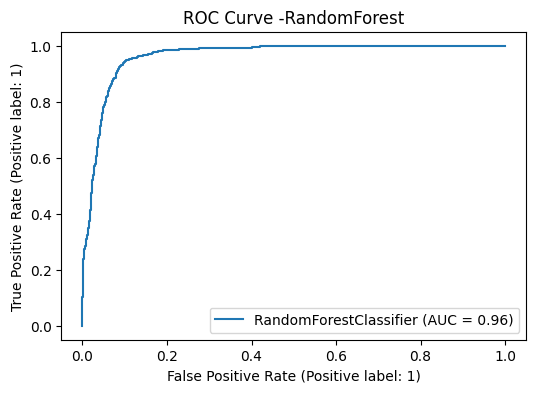
</p>
<p align="center">
  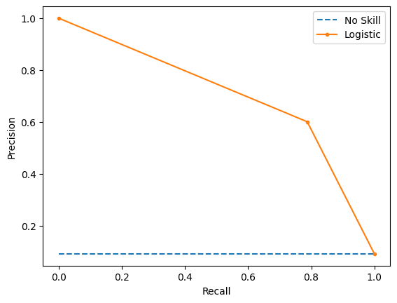
</p>

---

### 2. Classical ML — XGBoost

- Gradient boosting implementation
- Hyperparameter tuning via GridSearchCV
- Balanced using `scale_pos_weight` based on class ratio

**Notebook:** [`src/modeld/classifier_classical.py`](src/modeld/classifier_classical.py)

XGBoost outperforms Random Forest on all metrics, better precision/recall balance, higher AUC-ROC, and faster to train than DL models.

| Precision | Recall | F1 | AUC-ROC |
|---|---|---|---|
| 0.72 | 0.75 | 0.74 | 0.981 |

<p align="center">
  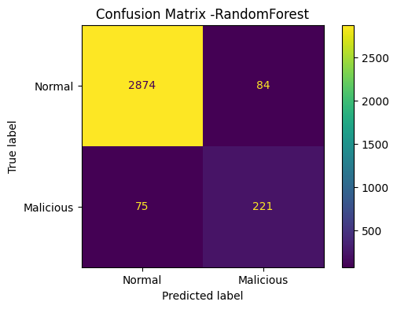
  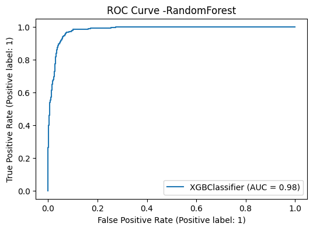
</p>
<p align="center">
  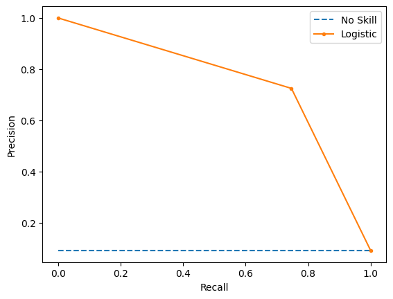
</p>

---

### 3. Supervised Deep Learning

All three models implemented using [tsai](https://github.com/timeseriesAI/tsai) + PyTorch on windowed CERT sequences.

#### 3a. MLSTM-FCN

- Combines LSTM with Fully Convolutional Networks

**Notebook:** [`src/models/msltm_fcn.py`](src/modeld/msltm_fcn.py)

| Precision | Recall | F1 | AUC-ROC | AP |
|---|---|---|---|---|
| 0.78 | 0.65 | 0.71 | 0.967 | 0.80 |

  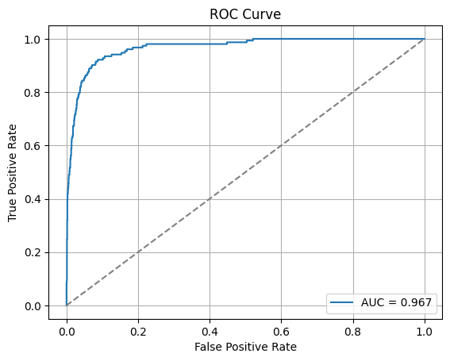
</p>
<p align="center">
  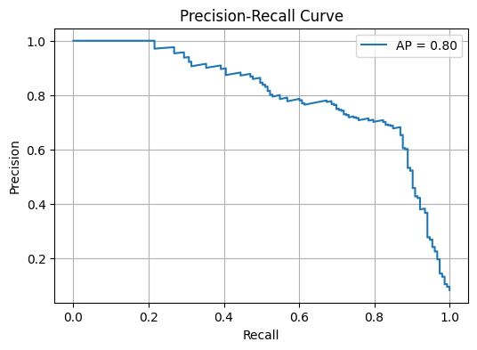
</p>

---

#### 3b. TST — Time Series Transformer ⭐ Best model

**Notebook:** [`src/models/tst.py`](src/models/tst.py)

Best-performing model overall. Self-attention captures long-range temporal dependencies in user behavior that recurrent and convolutional models partially miss.

- Transformer architecture for temporal data
- Multi-head self-attention for long-range dependencies
- Positional encoding for sequence order

| Precision | Recall | F1 | AUC-ROC | AP |
|---|---|---|---|---|
| **0.86** | 0.73 | **0.79** | **0.987** | **0.90** |

<p align="center">
  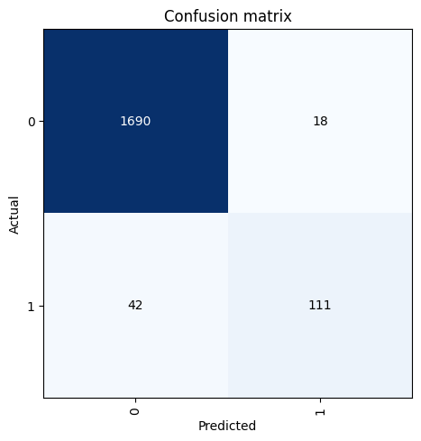
  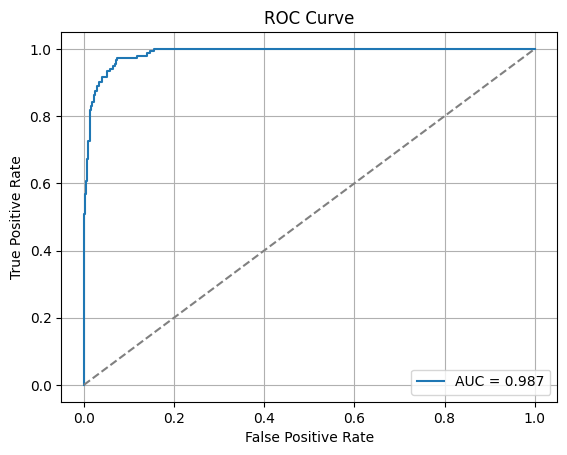
</p>
<p align="center">
  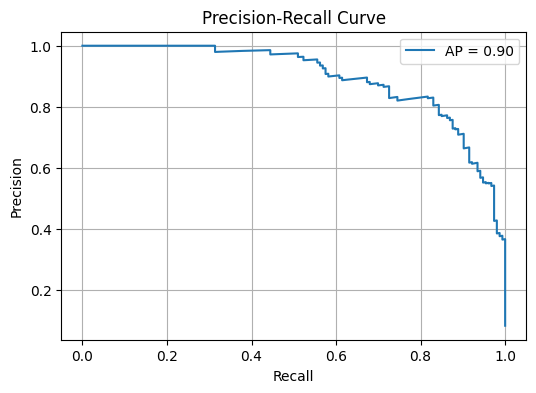
</p>

---

#### 3c. InceptionTime

**Notebook:** [`src/models/inception_time.py`](src/models/inception_time)

Inception-module 1D CNN. Ties TST on precision (0.86) — fewest false alarms, making it the best choice in alert-sensitive SOC environments.
- Multiple parallel convolutional paths
- Proven effective on UCR archive benchmarks

| Precision | Recall | F1 | AUC-ROC | AP |
|---|---|---|---|---|
| **0.86** | 0.67 | 0.75 | 0.961 | 0.84 |

<p align="center">
  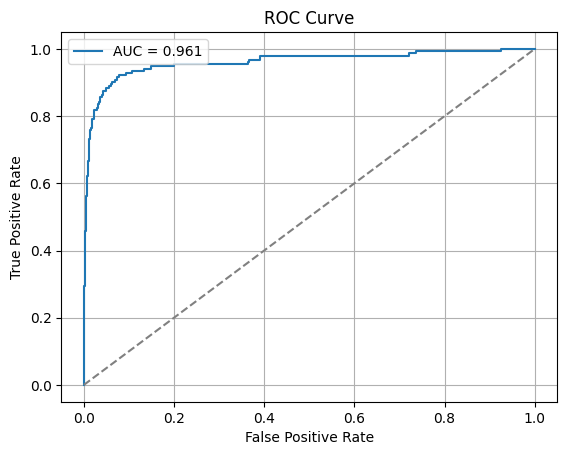
</p>
<p align="center">
  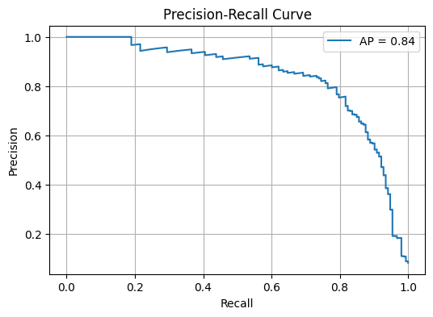
</p>

---

### 4. Unsupervised Deep Learning — LSTM Autoencoder

**Notebook:** [`src/models/lstm_ae.ipynb`](src/models/lstm_ae.py)

Trained **without labels** — learns to reconstruct normal behavior, then flags high-reconstruction-error sequences as anomalies. Tested across 6 contamination rates to study threshold sensitivity under realistic imbalance conditions.

 **Architecture**: 
  - Encoder: 2 LSTM layers (32 → 16 units)
  - Decoder: 2 LSTM layers (16 → 32 units)
  - L2 regularization on bottleneck layer
  - Time window size: 3 days
- **Training**: 95 epochs, batch size 256, Adam optimizer (lr=0.0001)
- **Anomaly Detection**: Reconstruction error thresholding (optimal threshold via TPR=TNR intersection)

#### Contamination sensitivity

| Contamination | F1 | Precision | Recall | AUC-ROC |
|---|---|---|---|---|
| 50% | 0.77 | 0.77 | 0.77 | 0.841 |
| 20% | 0.56 | 0.44 | 0.76 | 0.826 |
| 10% | 0.32 | 0.21 | 0.70 | 0.763 |
| 5% | 0.19 | 0.11 | 0.70 | 0.757 |
| 2% | 0.08 | 0.04 | 0.69 | 0.760 |
| 1% | 0.06 | 0.03 | 0.71 | 0.779 |
| 0.5% | 0.06 | 0.03 | 0.69 | 0.765 |

> As contamination approaches real-world rates, precision collapses while recall stays ~0.70. Stable AUC-ROC (~0.84) confirms genuine discriminative learning — the bottleneck is threshold calibration, not feature quality.

<!-- #### Reconstruction error distribution (20% contamination)

<p align="center">
  
</p>

> Meaningful (though partial) separation between normal and malicious reconstruction errors — the model has learned behavioral patterns without any labels. -->

#### 50% contamination results

<p align="center">
  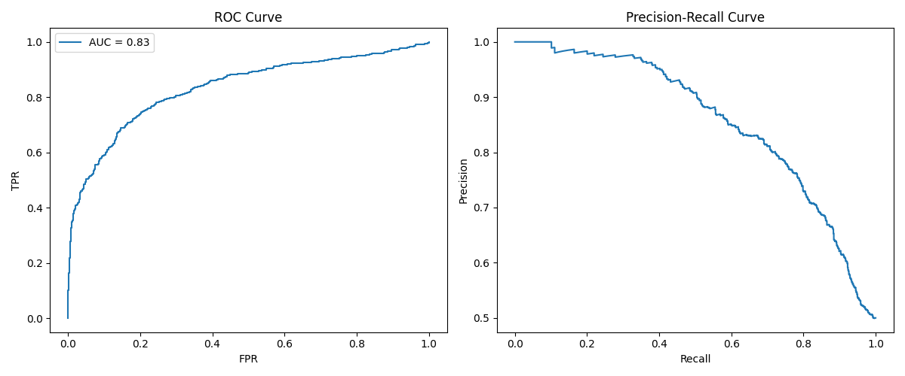
</p>
<p align="center">
  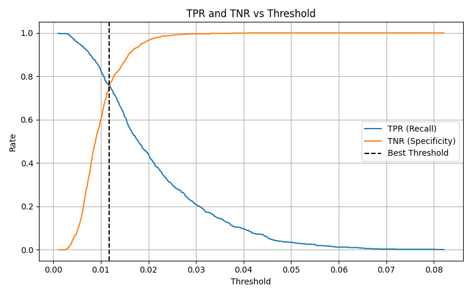
</p>

#### 20% contamination

<p align="center">
  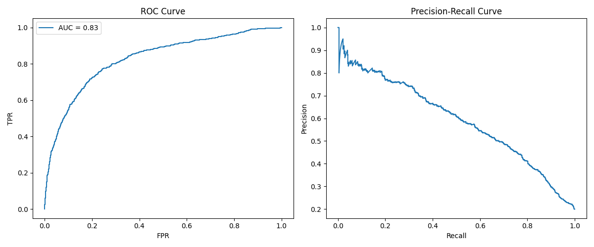
</p>
<p align="center">
  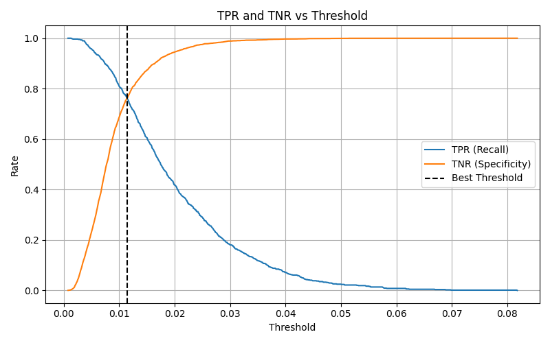
</p>
<!-- <p align="center">
  
</p> -->

<details>
<summary>Lower contamination rates (10% → 0.5%)</summary>

**10%**
<p align="center">
  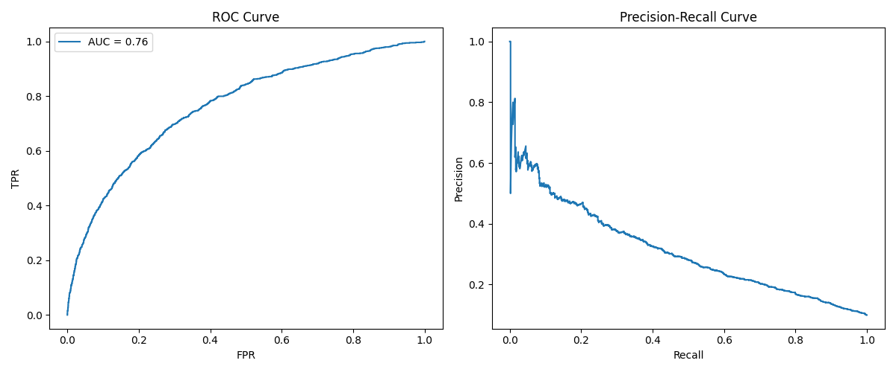
  
</p>

**5%**
<p align="center">
  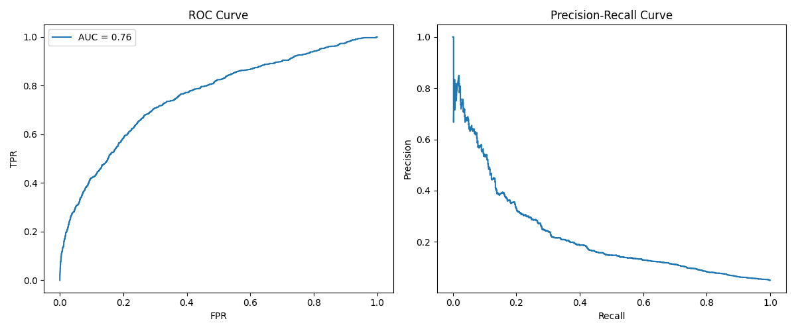
  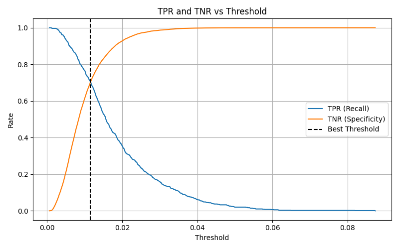
</p>

**2%**
<p align="center">
  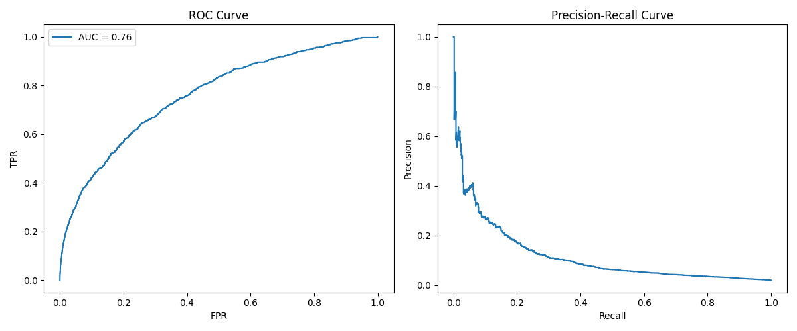
  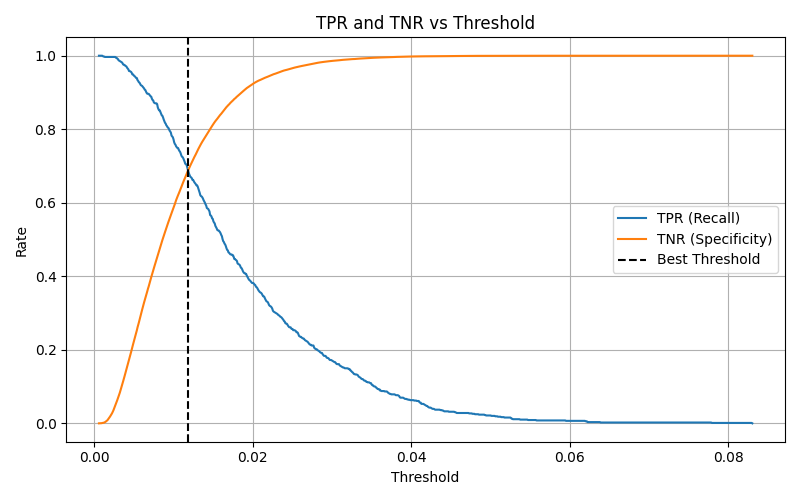
</p>

**1%**
<p align="center">
  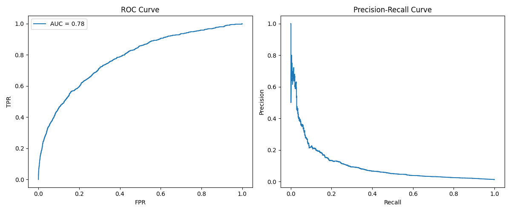
  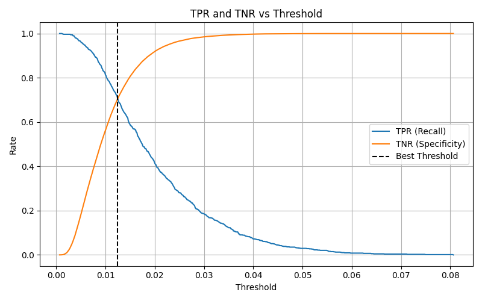
</p>

**0.5%**
<p align="center">
  
  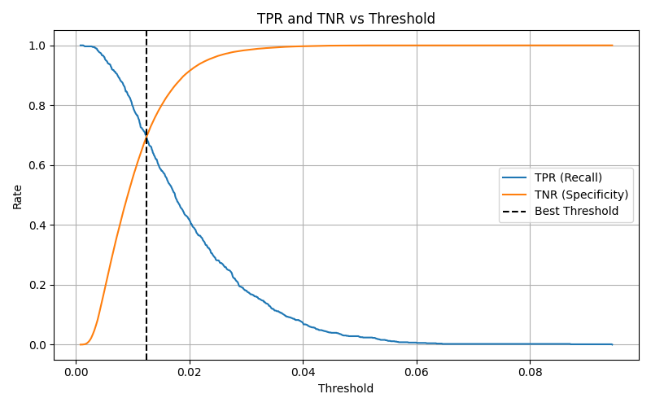
</p>

</details>

---

## Setup

```bash
git clone https://github.com/YOUR_USERNAME/cert-anomaly-detection.git
cd cert-anomaly-detection
conda env create -f environment.yml && conda activate cert-anomaly
# or: pip install -r requirements.txt
```

**Core deps:** Python 3.9+, PyTorch 2.0+, scikit-learn, XGBoost, tsai, pandas, matplotlib, seaborn

---

## Discussion

1. **Supervised models dominate when labels exist** — TST and XGBoost both exceed AUC-ROC 0.98 vs 0.84 for the best unsupervised result.
2. **XGBoost is the pragmatic choice** — matches deep learning F1 at a fraction of training cost, easy to explain to security analysts.
3. **InceptionTime minimizes false alarms** — joint-highest precision (0.86), best for alert-sensitive SOC environments.
4. **LSTM-AE shows genuine unsupervised potential** — AUC-ROC 0.84 without any labels is significant; practical deployment requires better threshold calibration.
5. **The contamination sensitivity study is a standalone finding** — directly addresses the real deployment question: *what happens when you don't know the base rate?*

---

## Limitations & Future Work

- CERT is synthetic; real insider threat distributions may differ.
- LSTM-AE threshold calibration (Platt scaling, isotonic regression) could close the gap with supervised methods.
- Semi-supervised approaches using a small labeled set to guide the unsupervised threshold.
- Explainability: SHAP for XGBoost, attention visualization for TST.

---

## Citation

```bibtex
@misc{cert2020insider,
  author = {{CERT Division, Carnegie Mellon University}},
  title  = {Insider Threat Test Dataset},
  year   = {2020},
  doi    = {10.1184/R1/12841247.v1},
  url    = {https://kilthub.cmu.edu/articles/dataset/Insider_Threat_Test_Dataset/12841247}
}
```

---

## License

MIT — see [`LICENSE`](LICENSE).

---

*Research thesis project — time-series anomaly detection for insider threat detection in cybersecurity.*